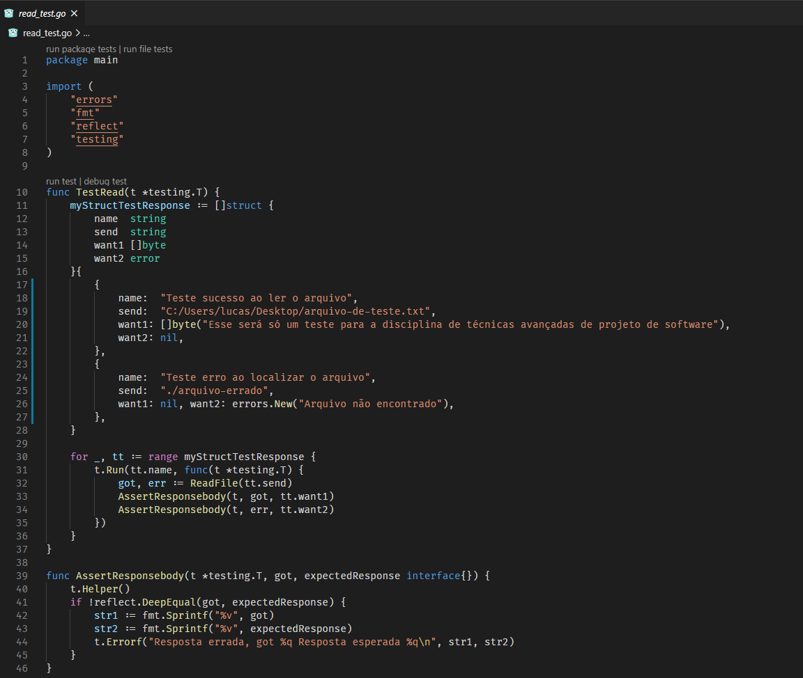
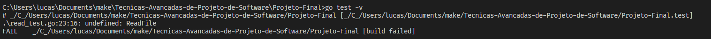
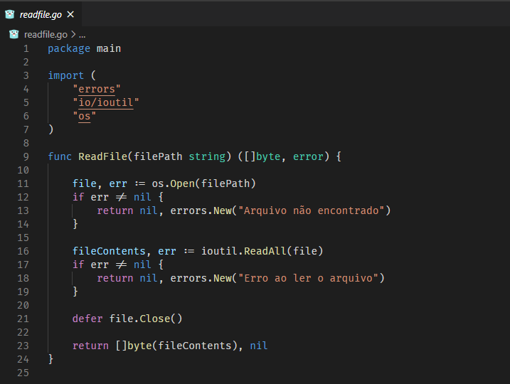
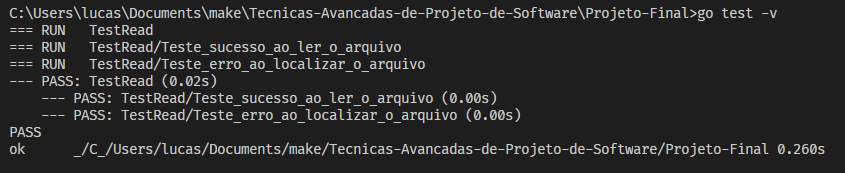
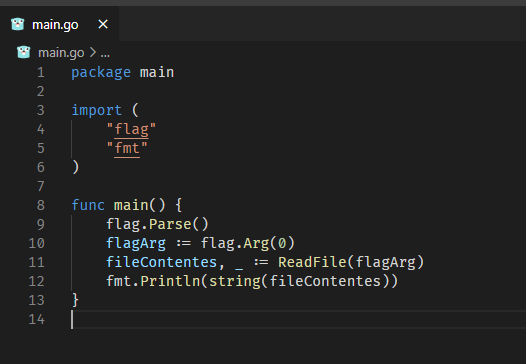
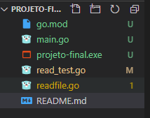
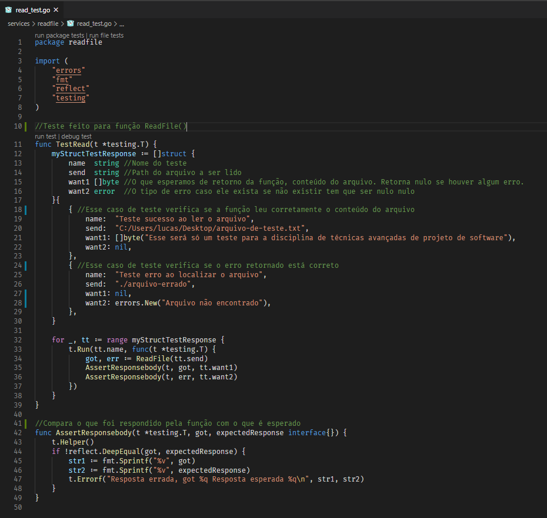
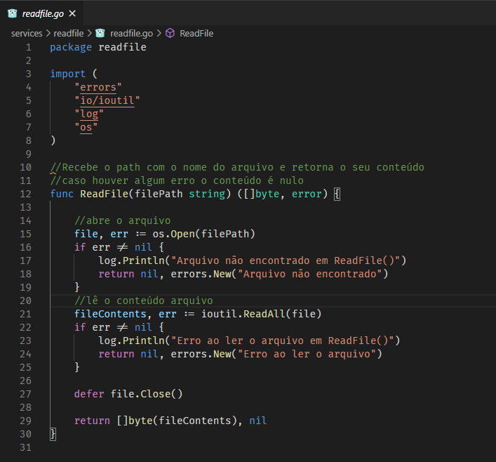
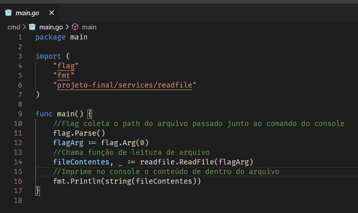
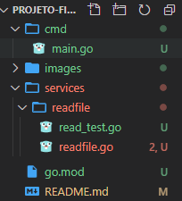

# Projeto Final
Esse é uma proposta de finalização da disciplina de técnicas avançadas de projeto de software.
A proposta é de utilizar dentro de um código a nossa escolha 3 técnicas vistas durante a disciplina, eu utilizarei o Git, o TDD e o Clean Code. 

Primeiramente farei as vantagens e desvantagens de cada uma das ferramentas e técnicas.

Pode acompanhar minha explicação no vídeo abaixo.

 [](https://www.youtube.com/watch?v=JeQuelXsUYA)


## Git

**As Vantagens**

A Primeira vantagem é de poder ver o que está sendo feito de forma simples, poder retornar uma versão do código caso dê problema sem afetar os demais, ter controle do que a equipe está produzindo, dividir as tarefas sem afetar o projeto em produção.

**As Desvantagens**

Uma das desvantagens é aprender a utilizar a ferramenta, outra é que se uma alteração feita no código pode comprometer outra parte, podendo ocasionar problemas em produção, falta de documentação e descrição do que está sendo feito pode ocasionar problemas de manutenção.

## TDD

**As Vantagens**

O código pode ser mais limpo e coeso, a confiabilidade do que está sendo feito é maior, favorece a o desenvolvimento de documentação, torna a refatoração mais fácil.

**As Desvantagens**

Os casos de testes tem que ter uma boa cobertura se não pode ocorrer de a funcionalidade passar naqueles testes mas o que realmente deveria fazer não funciona, pode haver uma dificuldade no início de pensar nos casos de testes, implementar a funcionalidade pensando em passar nos testes.

## Clean Code

**As Vantagens**

Deixa fácil a manutenção do código, a leitura fica mais amigável, com a documentação fica mais rápido de identificar o que cada coisa faz, a implementação de novas funcionalidades fica muito melhor.

**As Desvantagens**

Quando você está refatorando o código não se dá conta do que deve ser alterado, deixa mais demorado a programação se não tiver um pouco mais de experiência, às vezes o que é bom pra você pode não ser bom para o outro.

# Sobre o Projeto
O projeto consiste em um aplicativo feito em Go, bem básico que recebe o nome de um arquivo e o path (Pode ser txt, csv, etc..) e ele imprime na tela o conteúdo. Todo o desenvolvimento está sendo commitado em uma branch no GitHub, pode seguir os passos do desenvolvimento nesse [link](https://github.com/LucasCostakt/Tecnicas-Avancadas-de-Projeto-de-Software/tree/Projeto-Final/Projeto-Final).

### Primeira parte
Para começar utilizando o TDD fiz então as funções de teste e dois casos, o primeiro então é se o arquivo foi aberto corretamente e o segundo foi passado um nome de arquivo que não existe e então a função tem que retornar erro.



A função **AssertResponseBody** nada mais é onde vamos comparar o retorno da função de ler o arquivo com aquilo que esperamos, se for diferente o teste falha acionando o ```t.Errof``` caso for igual o teste da sucesso.

Sobre a estrutura do teste temos:

Var         | Type        | Descrição
:-------    | :---------  |:---------
name        | string      | Nome do teste
send        | string      | Path do arquivo a ser lido
want1       | []byte      | O que esperamos de retorno da função, conteúdo do arquivo. Retorna nulo se houver algum erro.
want2       | error      |O tipo de erro caso ele exista se não existir tem que ser nulo nulo

<br>

Rodando o teste:


### Segunda parte
Agora que tenho o teste e seus casos, posso dar inicio a confecção da função de leitura de arquivos, sabendo então que ela recebe o caminho do arquivo e seu nome e deve retornar o conteúdo e um erro caso exista, então ela ficou dessa forma.



Rodando o teste novamente.


A função passou nos dois casos propostos então está funcionando.

### Terceira parte

Precisamos criar a main onde ela vai ler a flag passada na linha de comando, onde contém o path do arquivo e também chamar a função de ler e imprimir o resultado.



E todas os arquivos ficaram em um só lugar também, já foi feito os commits já foi feito o Testes as funções passaram mas ainda falta refatorar.

O projeto está nesse formato.



### Quarta parte

Usando os princípios do clean code colocarei comentários dentro do código, farei a separação das funções em pacotes e reformularei o que for necessário.

Primeiro foi adicionados comentários aos testes, agora quem ler vai saber o que cada um faz, facilitando a vida de quem irá adicionar novos casos ou criar novos testes.



<br>
<br>

Após isso mudei também a função de ler o arquivo, coloquei comentários identificando o que a função faz e o que os componentes dela executam, além de adicionar logs de erro quando eles acontecerem, com isso dá para ter um controle melhor do que está acontecendo.



<br>
<br>

A main foi modificada seguindo os mesmos princípios, coloquei alguns comentários para deixar melhor o seu entendimento.



<br>
<br>

Por fim alterei a estrutura dos pacotes para que o projeto fique melhor organizado, utilizei como referência o [golang-standards/project-layout](https://github.com/golang-standards/project-layout).



## Conclusão

Acredito que deu bem pra aprender e fortalecer essas técnicas, a disciplina é rica em conteúdo, muito deles voltado às tendências e necessidades do mercado de desenvolvimento de software como o que foi abordado nesse projeto além de Padronização de código, Refatoração, Design Patterns, MVC, 
Práticas ágeis para arquitetura de software entre outros.

Nesse projeto posso ter incluído algo que foi abordado também mas não comentei durante o artigo, porém as técnicas aprendidas vão ser de grande ajuda no mercado de trabalho e no desenvolvimento em geral, aprendi muito durante ela e pretendo continuar praticando.